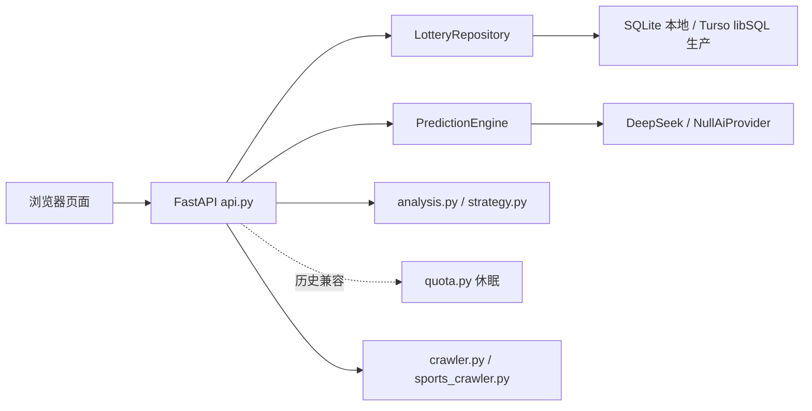

# 架构说明

## 总览

项目由一个 FastAPI 应用提供 API 和静态前端。后端负责历史开奖数据读取、爬虫补采、号码生成、数据分析、策略回测、额度控制和云端记录；前端是多页面原生应用。



## 页面

- `/`：首页起盘。负责表单、彩种切换、额度状态、解锁面板、本地历史记录、起盘解释链。
- `/analysis.html`：分析中心。负责热冷遗漏、走势、筛选器、回测、号码池、开奖日历。
- `/strategy.html`：策略实验室。负责策略候选、策略回测和策略对比。
- `/result.html`：历史财运号详情。读取本地历史记录，展示起盘报告和分享海报。
- `/admin.html`：后台。负责数据健康、补采任务、玄学权重和商业化配置展示。

## 核心后端模块

### `api.py`

统一注册 API 路由，并通过 `StaticFiles` 托管 `web/`。

主要路由：

- `GET /api/health`
- `GET /api/games`
- `POST /api/predict`
- `POST /api/review/{game_key}`
- `GET /api/analysis/{game_key}`
- `POST /api/filter/{game_key}`
- `POST /api/backtest/{game_key}`
- `POST /api/strategy/{game_key}/generate`
- `POST /api/strategy/{game_key}/backtest`
- `POST /api/number-pool/{game_key}/analyze`
- `GET /api/calendar`
- `GET /api/quota/status`
- `POST /api/quota/mock-unlock`
- `GET /api/cloud/fortune-records`
- `POST /api/cloud/fortune-records`
- `GET /api/admin/data-health`
- `GET /api/admin/settings`
- `GET /api/admin/tasks`
- `POST /api/admin/tasks/run`

### `predictor.py`

`PredictionEngine` 负责生成号码和解释 payload。它将历史数据、个人时空、开奖日、AI 特征、模式权重组合起来，返回：

- `numbers`
- `luck_score`
- `best_draw_date`
- `metaphysics_profile`
- `daily_fortune_sign`
- `ritual_steps`
- `master_ritual`
- `credibility_chain`
- `number_reasons`
- `fortune_report`

号码仍由本地算法生成；AI 只提供受限特征和文案辅助。

### `analysis.py`

负责基础分析工具：

- 热号、冷号、遗漏
- 走势格
- 奇偶比、大小比、区间分布、和值
- 号码筛选
- 回测
- 号码池点评
- 开奖日历 payload

### `quota.py`

历史商业化 V1 模块暂时保留，生产默认休眠。当前前端不展示支付、会员、次数包、额度状态或模拟购买入口，也不调用额度接口；生产 API 应配置 `LOTTERY_LUCK_QUOTA_ENABLED=false`。

该模块曾负责：

- `quota_accounts`：本地 client 的额度账户。
- `quota_usage`：赠送、免费、会员每日额度的消耗记录。
- `cloud_fortune_records`：付费态云端记录。

额度扣减优先级：

1. 新用户赠送次数。
2. 当日免费次数。
3. 会员每日次数。
4. 已购买次数包。

### `settings.py`

集中配置：

- `metaphysics_weights`
- `ai_copy_styles`
- `prediction_quota`

可通过 `LOTTERY_LUCK_SETTINGS_PATH` 指向 JSON 文件覆盖。

## 数据层

默认数据库路径：

```text
cwl_history/cwl_history.sqlite
```

本地和测试默认使用标准 SQLite。生产环境由 `lottery_luck.database.connect_database()` 根据 `TURSO_DATABASE_URL` 和 `TURSO_AUTH_TOKEN` 切换到 Turso/libSQL；领域模块通过 repository 访问数据，不直接感知本地或远端连接。

主要数据：

- `draws`：开奖历史。
- `crawl_logs`：爬虫日志。
- `admin_tasks`：后台任务队列。
- `quota_accounts`：额度账户。
- `quota_usage`：额度消耗。
- `cloud_fortune_records`：云端记录 V1。

生产迁移时，五个前台彩种 `ssq`、`dlt`、`3d`、`pl3`、`kl8` 必须在 Turso 导入后用 source snapshot 对比 count 和 latest issue。历史额度、会员和云端付费记录不是上线依赖。

## 部署拓扑

Vercel 使用两个项目：

- API 项目：Root Directory 为仓库根目录，运行 FastAPI/Python Functions，持有 `TURSO_DATABASE_URL`、`TURSO_AUTH_TOKEN`、`DEEPSEEK_API_KEY`、`DEEPSEEK_MODEL`、`LOTTERY_LUCK_ADMIN_TOKEN`、`CRON_SECRET`、`ALLOWED_ORIGINS` 和 `LOTTERY_LUCK_QUOTA_ENABLED=false`。
- Web 项目：Root Directory 为 `frontend`，只持有 `API_BASE_URL=https://<api-project>.vercel.app`，通过 API 项目读取预测、分析、抓取和后台数据。

DeepSeek 调用只发生在 API 项目。Web 构建产物、Local Storage 和网络请求中都不应出现 DeepSeek key、Turso token、管理员 token 或 cron secret。

## 前端状态

首页使用 `localStorage` 保存：

- `lotteryLuck.clientId.v1`：本地 client id，用于 V1 额度和云端记录。
- `lotteryLuck.fortuneHistory.v1`：本机历史财运号。

免费用户只依赖本地记录；付费态会调用云端记录 API。

## 彩种边界

前台展示彩种固定为：

```text
ssq, dlt, 3d, pl3, kl8
```

`qlc`、`pl5` 在规则层仍保留，但当前前台隐藏，避免产品范围发散。
