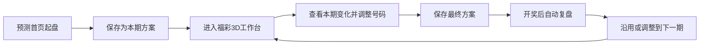

# 福彩3D工作台与开奖复盘闭环设计

日期：2026-07-12

## 背景

当前产品已经具备玄金电影感起盘、历史开奖分析、条件筛选、策略回测、号码池、历史记录和开奖复盘。现有功能数量充足，但用户主线仍停留在“填写资料、生成一组财运号、阅读解释”。财运号适合作为引流和首次体验，不适合作为长期留存核心：开奖结果具有随机性，连续未中奖会快速消耗用户对预测叙事的信任。

下一阶段不删除预测首页，也不弱化其视觉记忆点。产品将形成明确分工：预测首页负责引流和第一次方案生成，福彩3D工作台负责开奖前准备、方案管理和专业工具，开奖复盘负责让用户在开奖后回来，并把本期经验带到下一期。

## 产品定位

产品定位调整为：

> 有东方仪式感的彩票数据与选号工作台。

三类价值分别承担不同任务：

- 玄金起盘负责让用户愿意开始。
- 数据工具负责让用户持续使用。
- 个人方案与开奖复盘负责让用户回来。

产品不承诺提高中奖率，不把历史统计包装成未来预测，不提供线上购彩或代购服务。

## 目标

- 保留 `/` 作为电影感预测首页和主要引流入口。
- 第一阶段聚焦福彩3D，完成一个彩种的完整留存样板。
- 建立“保存方案 -> 开奖复盘 -> 调整下一期”的跨开奖周期闭环。
- 同时服务普通用户和资深用户，默认简单模式，可切换专业模式。
- 把财运号、手选、条件筛选和随机选号统一沉淀为可复盘的本期方案。
- 建立产品漏斗和留存指标，后续迭代由真实行为数据驱动。
- 在公开上线前补齐数据新鲜度、后台权限、个人信息和第三方 AI 数据边界。

## 非目标

- 本阶段不同时重做双色球、大乐透、排列3和快乐8。
- 不接入真实支付、订单、订阅和退款。
- 不建设专家荐号、晒单、跟单或预测社区。
- 不把遗漏、冷热、K线或断组描述为高概率信号。
- 不复制竞品的功能九宫格作为主体验。
- 不删除现有电影感首页，也不在起盘结束后强制跳转。

## 核心用户

采用双层用户模型：

### 普通用户

希望快速了解本期情况、整理几组号码并在开奖后知道结果。默认进入“本期助手”，不要求理解 AC 值、012 路、断组或复杂遗漏指标。

### 资深用户

希望使用百十个位统计、遗漏、定位、组合查询和缩水条件。可在同一工作台切换“专业模式”，并继续使用同一个目标期号、号码池和方案上下文。

两种模式共享数据和方案，不建设彼此割裂的普通版、专业版页面。

## 核心留存循环



财运号只是方案来源之一。用户即使不使用玄学起盘，也可以从手选、快速筛选或专业工具进入同一闭环。

## 页面与信息架构

### 预测首页 `/`

保持现有玄金电影感起盘体验。真实结果落盘后增加两个明确动作：

- `保存为本期方案`
- `去3D工作台继续筛选`

当彩种为福彩3D时，保存后的方案进入当前目标期。方案来源标记为 `fortune`。页面不自动跳转，用户可以继续阅读现有解释内容。

其他彩种继续使用现有历史记录，暂不进入新版工作台闭环。

### 福彩3D工作台 `/analysis.html?game=3d`

现有分析页在福彩3D下升级为双层工作台。

#### 本期头部

- 最新开奖期号、日期、号码和销量。
- 当前目标期号和预计开奖时间。
- 数据最后同步时间与健康状态。
- 我的本期方案数量和待复盘数量。

数据过期时显示明确警告，并禁用依赖“本期”语义的推荐和预警；历史查询仍可使用。

#### 普通模式：本期助手

- 百位、十位、个位近期活跃数字摘要。
- 当前高遗漏数字和历史基准说明。
- 近期和值、跨度、组三/组六分布。
- 快速生成、手动编辑和添加号码。
- 本期方案列表。
- 开奖后复盘入口。

普通模式只提供少量可理解的筛选条件，不展示专业术语矩阵。

#### 专业模式

- 百十个位走势图。
- 出次统计与位置遗漏。
- 号码查询与号码属性。
- 定位查询。
- 缩水选号。
- 后续阶段增加复式、胆拖、未出号码、遗漏预警和K线。

普通模式与专业模式共享：

- 当前彩种。
- 目标期号。
- 统计窗口。
- 当前候选号码池。
- 已保存方案。

### 方案详情 `/result.html?id={plan_id}`

现有财运详情页升级为通用方案详情和复盘页：

- 方案号码和来源。
- 创建时使用的筛选条件快照。
- 当时的数据窗口和指标摘要。
- 开奖结果与命中情况。
- 单选、组选3、组选6结果。
- 有效条件、失效条件和中性条件。
- `沿用到下一期` 与 `调整后新建`。

玄学解释只在来源为 `fortune` 时展示；手选和数据筛选方案不强行添加命理叙事。

### 策略实验室 `/strategy.html`

短期保持可用，但不再作为一级增长入口。后续把回测、预设对比和保存策略并入福彩3D专业模式，避免分析中心和策略实验室重复。

### 数据后台 `/admin.html`

从公共导航移除。公开部署前必须增加管理员身份验证，所有 `/api/admin/*` 写操作必须鉴权。

## 功能定义与优先级

### P0：生产基础

- 开奖数据自动补采与同步监控。
- 数据健康状态进入首页和工作台。
- 数据过期时禁止展示“本期分析”结论。
- 后台鉴权与公共入口移除。
- 隐私说明、理性购彩说明和未成年人限制。
- 第三方 AI 只接收派生特征，不接收姓名、完整生日、出生地和当前城市原文。
- 基础产品事件和漏斗记录。

### P1：最小留存闭环

- 财运号保存为本期方案。
- 本期方案新增、编辑、复制和删除。
- 号码查询与号码属性。
- 开奖后自动验号与复盘。
- 方案沿用到下一期。
- 方案详情页统一承载复盘。

### P2：福彩3D工作台

- 百十个位走势图。
- 出次统计。
- 位置遗漏统计。
- 冷热分布，明确统计窗口和定义。
- 定位查询。
- 普通/专业模式切换。
- 快速筛选生成候选方案。

### P3：专业工具

- 缩水选号。
- 复式查询。
- 胆拖查询。
- 未出号码。
- 遗漏预警。
- 多方案对比。

### P4：实验能力

- 遗漏K线。
- 断组统计与随机基准对比。
- 3星复盘。
- 条件历史表现。
- 周期报告。

P4 功能必须先明确统计定义和随机基准，不能用高命中率话术制造错误预期。

## 数据模型

### `lottery_plans`

保存用户面向某一期的方案：

```text
id
client_id
game_key
target_issue
target_draw_date
source_type
title
status
created_at
updated_at
```

`source_type` 可取：

- `fortune`
- `manual`
- `filter`
- `random`
- `carried`

`status` 可取：

- `draft`
- `saved`
- `pending_review`
- `reviewed`
- `expired`

### `lottery_plan_entries`

一个方案可以包含多组号码：

```text
id
plan_id
position
main_numbers
special_numbers
note
created_at
```

福彩3D的 `main_numbers` 保存有序三位数字，允许重复。

### `plan_condition_snapshots`

记录方案创建时的筛选条件和数据上下文：

```text
plan_id
analysis_window
conditions_json
metrics_json
latest_data_issue
latest_data_date
created_at
```

复盘必须使用快照，不能用开奖后的新数据回算并冒充当时依据。

### `plan_reviews`

```text
plan_id
draw_issue
draw_numbers
review_status
direct_hit
group_type
matched_positions
matched_conditions
missed_conditions
reviewed_at
```

### `product_events`

第一阶段只记录最小产品事件：

- `prediction_completed`
- `plan_saved`
- `workbench_opened`
- `plan_edited`
- `review_viewed`
- `plan_carried_forward`

事件不保存姓名、生日、地点或完整命理输入。

## API 边界

建议新增或扩展：

- `GET /api/workbench/3d/summary`
- `POST /api/3d/number-query`
- `POST /api/3d/filter`
- `GET /api/plans`
- `POST /api/plans`
- `GET /api/plans/{plan_id}`
- `PATCH /api/plans/{plan_id}`
- `DELETE /api/plans/{plan_id}`
- `POST /api/plans/{plan_id}/review`
- `POST /api/plans/{plan_id}/carry-forward`
- `POST /api/events`

沿用 `X-Lottery-Client-Id` 作为第一阶段匿名身份。接口只能访问当前 client 的方案。真实账号体系上线后再迁移到 user id。

## 统计定义

### 出次

按统计窗口计算数字在全部位置或指定位置出现的次数。界面必须标明窗口和位置。

### 遗漏

某数字在指定位置距离最近一次出现所经过的期数。展示当前遗漏、平均遗漏、最大遗漏和历史分位，不使用“该出了”等文案。

### 冷热

由固定统计窗口内的频次和遗漏共同分层。界面展示定义，不把冷号、热号直接等同于未来概率。

### 号码属性

至少包括：

- 和值与和尾。
- 跨度。
- 奇偶与大小。
- 012路。
- 质合。
- 豹子、组三、组六。
- 重号、连号和相邻关系。

### 缩水

从 `000-999` 枚举合法直选号码，再依次应用用户选择的条件。每个条件展示过滤前后数量，用户可以撤销单个条件。

### 断组

把 `0-9` 分成若干组，统计开奖号码是否全部落入同一组。必须展示随机基准和实际缩减比例，不能仅展示看似较高的“成功率”。

### 3星复盘

暂定为对三位号码策略的历史回放。进入实施前必须补充内页样本并确认星级、命中和复盘定义；定义不明确前不得开发。

## 错误与边界处理

- 数据过期：工作台切换为历史查询模式，关闭本期摘要、预警和自动建议。
- 数据同步失败：显示最后成功期号和失败原因，不静默使用旧数据。
- 目标期已开奖：保存动作改为查看复盘或创建下一期方案。
- 重复保存：允许多个方案，但同一来源和相同号码提示重复。
- 开奖数据缺失：复盘保持 `pending_review`，不伪造结果。
- 用户切换彩种：福彩3D方案上下文不带入其他彩种。
- 本地存储不可用：保留当前页面编辑，不宣称已经保存。
- 云端保存失败：方案进入待同步状态，可重试，不覆盖本地副本。
- 匿名身份丢失：不允许通过猜测 plan id 访问其他 client 的方案。

## 隐私、安全与责任边界

- 首页收集个人资料前展示用途和第三方处理说明。
- DeepSeek 上下文改为五行向量、时辰类别和匿名派生特征，不发送个人原文。
- 方案和事件不保存完整姓名、出生日期、出生地或当前城市。
- 提供本地记录清除、云端记录删除和匿名身份重置入口。
- 后台读写接口统一鉴权，补采任务增加频率限制和审计记录。
- 页面持续展示“仅供娱乐与数据分析参考，不构成投注建议”。
- 不展示倒计时压迫、连红刺激、必中、稳赚或提高中奖率文案。
- 公开版本标记 18+，增加理性购彩和量力而行提示。

## 产品指标

北极星指标：

> 完成一次“保存方案 -> 查看开奖复盘 -> 创建下一期方案”的用户数。

核心漏斗：

1. 起盘完成到保存方案。
2. 保存方案到打开工作台。
3. 保存方案到开奖后查看复盘。
4. 查看复盘到沿用或新建下一期方案。
5. 连续两个开奖周期活跃。

首轮实验目标：

- 起盘后方案保存率不低于 30%。
- 保存方案用户的开奖后回访率不低于 20%。
- 查看复盘后的下一期建案率不低于 30%。

这些目标用于验证产品假设，不作为长期承诺；上线后根据真实基线调整。

护栏指标：

- 数据过期时仍展示本期结论的次数必须为 0。
- 未授权访问后台写接口的成功次数必须为 0。
- 复盘结果与官方开奖不一致次数必须为 0。
- 第三方 AI 请求中出现个人原文的次数必须为 0。

## 测试策略

### 统计单元测试

- 位置频次和遗漏的手工样本。
- 豹子、组三、组六分类。
- 和值、跨度、奇偶、大小和012路。
- 缩水条件逐步过滤和撤销。
- 断组实际结果与随机基准。

### API 测试

- 方案 CRUD 只能访问当前 client。
- 重复、过期目标期和缺失开奖处理。
- 复盘只使用真实开奖数据。
- carry-forward 创建下一期新方案且保留来源链。
- 数据过期时 summary 返回明确降级状态。
- 所有 admin 写接口拒绝未授权请求。

### 浏览器流程测试

- 财运号保存为福彩3D方案。
- 从预测首页进入工作台后号码存在。
- 普通模式和专业模式共享号码池。
- 开奖前显示待复盘，开奖后显示真实复盘。
- 沿用到下一期不会修改旧方案。
- 移动端无水平溢出，专业表格可阅读。

## 分阶段交付

### 阶段0：生产基础，3至5个开发日

数据自动更新、过期降级、后台鉴权、隐私说明、AI 数据最小化和基础埋点。

### 阶段1：最小留存闭环，7至10个开发日

预测页保存方案、方案管理、号码查询与属性、自动复盘、方案详情和沿用下一期。

### 阶段2：福彩3D工作台，7至10个开发日

普通/专业模式、位置走势、出次、遗漏、冷热、定位查询和快速筛选。

### 阶段3：专业工具，7至10个开发日

缩水、复式、胆拖、未出号码、遗漏预警和多方案对比。

### 阶段4：实验能力，5至7个开发日

遗漏K线、断组基准、3星复盘、条件历史表现和周期报告。

真实支付、专家社区和多彩种复制必须等待阶段1至2的留存数据验证。

## 成功标准

- 预测首页继续承担引流，不被专业工具替代。
- 福彩3D用户能从任意号码来源保存本期方案。
- 每个方案保留创建时条件和数据快照。
- 开奖后使用真实数据自动复盘，并能带到下一期。
- 普通用户不需要理解专业术语即可完成闭环。
- 资深用户能在同一上下文进入专业工具。
- 数据过期、同步失败和复盘等待都有明确降级状态。
- 后台、个人资料和第三方 AI 数据边界满足公开上线最低要求。
- 产品能测量完整开奖周期留存，而不是只统计生成次数。
