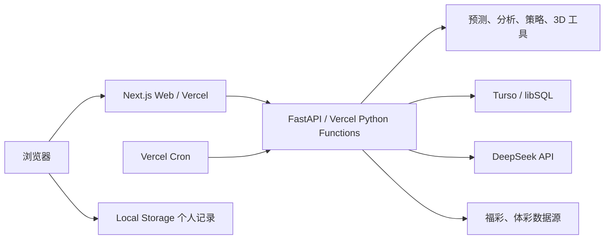

# Next.js + Vercel + Turso 迁移设计

## 目标

将现有 FastAPI 托管原生多页面前端的项目迁移为可长期部署的云端架构，同时保留开奖数据抓取、统计分析、预测和 DeepSeek 辅助能力。

本次迁移的产品边界：

- 首页继续以“输入个人信息并起盘预测”为主要引流入口。
- 保留分析中心、福彩 3D 专业工具箱、策略实验室、开奖记录和本地方案记录。
- 前端彻底移除会员、次数包、额度、解锁、模拟购买和付费云记录入口。
- 暂不删除后端 `quota.py` 等历史商业化代码，但生产请求不再依赖这些模块。
- DeepSeek API Key 只保存在服务端环境变量中，绝不进入浏览器包或 Local Storage。
- 开奖数据和抓取日志迁移到 Turso，浏览器端个人起盘记录继续写入 Local Storage。

## 方案选择

### 采用：Next.js + FastAPI + Turso

仓库保留 Python 领域逻辑，以两个 Vercel 项目部署：

1. Web 项目：Next.js App Router，负责页面、交互、SEO 和静态资源。
2. API 项目：FastAPI 运行在 Vercel Python Functions，负责预测、分析、抓取、管理接口和 DeepSeek 调用。
3. 两个项目共用一个 Turso 数据库，只有 API 项目持有数据库写入凭证。

这样可以在不重写成熟 Python 算法的前提下完成前端迁移，并让 SQLite 数据模型以较低成本迁移到 libSQL。

### 未采用：一次性重写为纯 Next.js 全栈

该方案需要将预测、分析、回测、爬虫和测试体系从 Python 重写为 TypeScript，改动面过大，且无法直接复用现有 800 余项测试。

### 未采用：Neon PostgreSQL

Neon 与 Vercel 集成更紧密，但现有代码大量直接使用 `sqlite3`、SQLite 函数和事务语义。当前数据库只有约 51MB，Turso 免费额度足够，迁移 PostgreSQL 的收益不足以覆盖改造成本。

## 目标架构

## 部署边界

### Next.js Web

Next.js 承接现有页面：

- `/`：预测首页。
- `/analysis`：分析中心。
- `/analysis/3d`：福彩 3D 专业工具箱。
- `/strategy`：策略实验室。
- `/result/[id]`：本地历史详情。
- `/admin`：数据健康和抓取管理后台。

Web 通过 `NEXT_PUBLIC_API_BASE_URL` 请求 FastAPI。生产环境 API 仅允许 Web 正式域名和预览域名发起跨域请求。

### FastAPI API

现有 Python 预测和分析模块继续作为唯一业务事实来源。API 项目不再托管 `web/` 静态目录，只暴露 JSON 接口。

生产环境变量：

- `TURSO_DATABASE_URL`
- `TURSO_AUTH_TOKEN`
- `DEEPSEEK_API_KEY`
- `DEEPSEEK_MODEL`
- `LOTTERY_LUCK_ADMIN_TOKEN`
- `CRON_SECRET`
- `ALLOWED_ORIGINS`
- `LOTTERY_LUCK_QUOTA_ENABLED=false`

所有秘密变量只配置在 API 项目中。Web 项目不能持有 Turso 写入 Token、DeepSeek Key 或管理口令。

## 数据设计

### Turso 云端数据

首批迁移生产必需数据：

- `draws`
- `crawl_logs`
- `admin_tasks`
- 分析、策略和 3D 工具依赖的计划表与索引

历史额度、会员和云端付费记录不作为上线依赖。旧商业化表可保留为空表，以降低旧代码导入风险，但不迁移模拟额度数据。

数据访问层增加统一连接工厂：

- 测试和本地离线模式继续支持标准 `sqlite3` 临时数据库。
- 生产模式根据 `TURSO_DATABASE_URL` 使用远程 libSQL。
- Repository、爬虫和任务模块不再自行打开硬编码的本地文件。
- SQL 参数、事务和返回行统一由适配层处理，领域模块不感知本地或远程连接差异。

### 浏览器本地数据

以下内容继续使用 Local Storage：

- 匿名客户端标识。
- 个人起盘历史。
- 收藏号码和本地方案。
- UI 偏好和最近使用的筛选条件。

Local Storage 不保存 DeepSeek Key、Turso Token、管理口令或服务端配置。

## 收费逻辑下线

前端删除：

- 额度状态和剩余次数文案。
- 会员权益、次数包和解锁面板。
- 模拟开通会员、模拟购买次数包按钮。
- `/api/quota/status` 和 `/api/quota/mock-unlock` 请求。
- 付费云端记录请求与“云端保存”状态。
- 后台商业化配置卡片。

预测请求不再传递 `consume_quota=true`。API 在 `LOTTERY_LUCK_QUOTA_ENABLED=false` 时跳过扣减、退款和额度不足响应，预测能力对所有访问者开放。

后端额度路由和模块暂时保留但不出现在 OpenAPI 对外文档中，不由任何生产页面调用。后续确认不再需要兼容时，再单独删除代码和表结构。

## 抓取与定时任务

Vercel Cron 每日调用受 `CRON_SECRET` 保护的抓取入口：

- 福彩：双色球、福彩 3D、快乐 8。
- 体彩：大乐透、排列 3。
- 每次抓取按 `game_key + issue` 幂等写入。
- 成功、失败、写入数量和数据源写入 `crawl_logs`。
- 单个彩种失败不回滚其他彩种，接口返回逐项结果。

Hobby 定时任务存在执行时刻浮动，因此产品只承诺“开奖后自动更新”，不承诺固定分钟完成。浏览器自动化抓取不作为 Vercel 主路径；优先保留直接 HTTP 数据源，浏览器兜底放在本地运维或独立任务中。

## DeepSeek 调用

DeepSeek 继续只做受限特征提取和文案辅助，不直接决定号码。调用链为：

1. Web 将起盘表单提交到 FastAPI。
2. FastAPI 本地算法生成候选号码和结构化特征。
3. FastAPI 使用服务端 `DEEPSEEK_API_KEY` 请求 DeepSeek。
4. DeepSeek 超时、限流或失败时降级到现有中性文案，号码生成不失败。
5. API 返回统一预测结果，Web 不接触供应商凭证。

## 错误处理与安全

- API 返回稳定的错误码和面向用户的中文提示，前端不展示 Python 异常详情。
- Turso 暂时不可用时，读取接口返回“数据服务暂不可用”，不回退到 Vercel 临时文件数据库。
- 抓取接口和管理接口同时校验管理 Token 或 Cron Secret。
- 对预测、DeepSeek 和管理接口设置独立超时与基础限流。
- 日志不得记录出生信息完整值、DeepSeek Key、Turso Token 或管理口令。
- 娱乐预测页面保留理性购彩和非中奖承诺提示。

## 迁移顺序

1. 建立 Next.js 应用壳和共享视觉变量，逐页迁移现有前端。
2. 抽象 Python 数据库连接层，并保持本地 SQLite 测试通过。
3. 创建 Turso 数据库、导入历史开奖数据并核对数量与最新期号。
4. 将 FastAPI 调整为独立 Vercel API 项目，配置秘密变量和 CORS。
5. 移除 Web 收费界面及相关请求，关闭生产额度控制。
6. 配置 Cron，验证抓取幂等、日志和失败恢复。
7. 完成桌面与移动端回归、真实预测、DeepSeek 降级和数据新鲜度验收。
8. 先发布预览环境，验收通过后切换正式域名。

## 验收标准

- Vercel Web 和 API 预览部署均可独立构建成功。
- 首页无需额度或付费操作即可连续完成起盘。
- 页面中不存在会员、次数包、解锁、购买或付费云记录入口。
- 浏览器构建产物和网络请求中不存在 DeepSeek Key 或 Turso Token。
- 五个前台彩种可以读取 Turso 历史数据并完成核心分析。
- 福彩 3D 工具箱现有功能和简易/高级模式无功能回退。
- Cron 可幂等写入新开奖，重复执行不会产生重复期号。
- DeepSeek 不可用时仍能返回本地算法结果。
- 本地 SQLite 单元测试继续通过，并新增 Turso 集成冒烟测试。
- 关键页面通过桌面和移动端浏览器视觉、交互与无障碍检查。

## 暂不包含

- 登录、账号体系和多设备同步。
- 微信或支付宝支付。
- 会员、次数包、订单和订阅。
- 将 Python 算法重写为 TypeScript。
- 将数据库迁移到 PostgreSQL。
